# MacroMaps Backend Server 🗺️

A Flask-based backend server for the MacroMaps application that provides restaurant discovery and menu analysis capabilities with nutritional information.

## 🚀 Features

### Core Functionality
- **Restaurant Discovery**: Find nearby restaurants using GPS coordinates
- **Real-time Data**: Integration with Apify API for Google Places data extraction
- **Mock Mode**: Development-friendly mock data generation for testing
- **Nutritional Analysis**: Detailed menu items with macro and nutritional information
- **Database Integration**: Supabase integration for persistent data storage
- **CORS Support**: Cross-origin resource sharing enabled for frontend integration

### API Capabilities
- Location-based restaurant search within customizable radius
- Restaurant data including ratings, reviews, contact information
- Menu items with detailed nutritional breakdown (calories, protein, carbs, fat)
- Restaurant images and photo metadata
- Opening hours and contact information
- Price level indicators

## 🏗️ System Architecture

```mermaid
graph TB
    %% Frontend/Client Layer
    Client[🌐 Frontend Client<br/>React/Mobile App]
    
    %% Main Flask Application
    Flask[🐍 Flask Server<br/>main.py<br/>Port: 5000]
    
    %% API Endpoints
    Health[🏥 /health<br/>Health Check]
    ScanNearby[📍 /scan-nearby<br/>Restaurant Discovery]
    
    %% Decision Logic
    MockCheck{Mock Mode?<br/>mock: true/false}
    
    %% Core Utilities
    MockUtils[🎭 Mock Utils<br/>mock_utils.py<br/>Generate Fake Data]
    ApifyUtils[🔍 Apify Utils<br/>apify_utils.py<br/>Real Restaurant Data]
    SupabaseUtils[🗄️ Supabase Utils<br/>supabase_utils.py<br/>Database Operations]
    LLMUtils[🤖 LLM Utils<br/>llm_utils.py<br/>Menu Analysis]
    
    %% External Services
    ApifyAPI[🌍 Apify API<br/>Google Places Crawler<br/>compass/crawler-google-places]
    SupabaseDB[(🗃️ Supabase Database<br/>PostgreSQL<br/>• restaurants table<br/>• menu_items table)]
    OpenAI[🧠 OpenAI API<br/>GPT Models<br/>Menu Analysis]
    
    %% Data Processing
    DataFormat[📋 Data Formatting<br/>• Standardize Structure<br/>• Add Nutritional Info<br/>• Generate Menu Items]
    
    %% Response Assembly
    Response[📦 JSON Response<br/>• Restaurant List<br/>• Menu Items<br/>• Nutritional Data<br/>• Location Info]
    
    %% Flow Connections
    Client -->|HTTP Request POST /scan-nearby| Flask
    Client -->|HTTP Request GET /health| Flask
    
    Flask --> Health
    Flask --> ScanNearby
    
    ScanNearby --> MockCheck
    
    %% Mock Mode Path
    MockCheck -->|Yes| MockUtils
    MockUtils --> DataFormat
    
    %% Real API Mode Path
    MockCheck -->|No| ApifyUtils
    ApifyUtils -->|API Call Location + Radius| ApifyAPI
    ApifyAPI -->|Restaurant Data + Menu Items| ApifyUtils
    ApifyUtils --> DataFormat
    
    %% Database Integration
    SupabaseUtils <-->|Query/Store Restaurant Data| SupabaseDB
    DataFormat --> SupabaseUtils
    
    %% LLM Enhancement (Future)
    DataFormat -.->|Menu Analysis Optional| LLMUtils
    LLMUtils -.->|Enhanced Nutrition Data| OpenAI
    
    %% Response Flow
    DataFormat --> Response
    Health --> Response
    Response -->|JSON Response| Client
    
    %% Styling
    classDef client fill:#e1f5fe
    classDef flask fill:#f3e5f5
    classDef utils fill:#e8f5e8
    classDef external fill:#fff3e0
    classDef database fill:#fce4ec
    classDef decision fill:#f1f8e9
    
    class Client client
    class Flask,Health,ScanNearby flask
    class MockUtils,ApifyUtils,SupabaseUtils,LLMUtils utils
    class ApifyAPI,OpenAI external
    class SupabaseDB database
    class MockCheck decision
```



## 🔄 Data Flow Diagram


## 🧩 Component Architecture

```mermaid
graph LR
    subgraph "🐍 Flask Application"
        Main[main.py<br/>• Route definitions<br/>• CORS setup<br/>• Error handling]
    end
    
    subgraph "🛠️ Utility Layer"
        direction TB
        ApifyUtil[apify_utils.py<br/>• API integration<br/>• Data extraction<br/>• Response formatting]
        MockUtil[mock_utils.py<br/>• Fake data generation<br/>• Realistic restaurants<br/>• Menu item creation]
        SupaUtil[supabase_utils.py<br/>• Database operations<br/>• Distance calculations<br/>• Data persistence]
        LLMUtil[llm_utils.py<br/>• Future AI features<br/>• Menu analysis<br/>• Nutrition enhancement]
    end
    
    subgraph "🌐 External APIs"
        direction TB
        Apify[Apify API<br/>• Google Places data<br/>• Restaurant scraping<br/>• Menu extraction]
        Supabase[Supabase<br/>• PostgreSQL database<br/>• Real-time features<br/>• Authentication]
        OpenAIAPI[OpenAI API<br/>• GPT models<br/>• Menu analysis<br/>• Nutrition insights]
    end
    
    subgraph "🧪 Testing Layer"
        direction TB
        TestApify[test_apify.py<br/>• API integration tests<br/>• Response validation]
        TestModels[test_models.py<br/>• Data model tests<br/>• Nutrition calculations]
    end
    
    Main --> ApifyUtil
    Main --> MockUtil
    Main --> SupaUtil
    Main -.-> LLMUtil
    
    ApifyUtil --> Apify
    SupaUtil --> Supabase
    LLMUtil -.-> OpenAIAPI
    
    TestApify --> ApifyUtil
    TestModels --> MockUtil
    TestModels --> SupaUtil
```



## 🎯 Ideal System Workflow

### 📋 Complete Restaurant Processing Pipeline

```mermaid
flowchart TD
    Start([🔍 User Scan Request<br/>POST /scan-nearby])
    
    CheckDB{🗄️ Check Supabase<br/>Restaurants in radius<br/>status = 'finished'}
    
    HasFinished{Found finished<br/>restaurants?}
    
    ReturnExisting[📤 Return existing<br/>finished restaurants]
    
    ApifyCall[🌍 Hit Apify API<br/>Extract new restaurant data<br/>in scan circle]
    
    ParallelProcess[⚡ Parallel Processing<br/>Push each restaurant<br/>to Supabase]
    
    UpdateStatus1[📝 Mark restaurants as<br/>status = 'processing']
    
    MenuPipeline[🤖 Start Menu Analysis Pipeline<br/>For each restaurant]
    
    GetImages[📸 Get image URLs<br/>from Supabase<br/>restaurant.image_urls]
    
    ClassifyMenus[🔍 Classify Images<br/>Which are menu images?]
    
    ExtractItems[📋 Extract Menu Items<br/>• Item name<br/>• Price only]
    
    MergeMenus[🧠 LLM Merge<br/>Combine all menu items<br/>into final menu]
    
    MacroAnalysis[🍎 LLM Macro Analysis<br/>Estimate nutritional info<br/>per menu item]
    
    SaveMenuItems[💾 Push Menu Items<br/>to Supabase<br/>with restaurant_id]
    
    MarkComplete[✅ Mark Restaurant<br/>status = 'finished']
    
    FinalResponse[📤 Return Complete<br/>Restaurant + Menu Data]
    
    Start --> CheckDB
    CheckDB --> HasFinished
    
    HasFinished -->|Yes| ReturnExisting
    HasFinished -->|No| ApifyCall
    
    ApifyCall --> ParallelProcess
    ParallelProcess --> UpdateStatus1
    UpdateStatus1 --> MenuPipeline
    
    MenuPipeline --> GetImages
    GetImages --> ClassifyMenus
    ClassifyMenus --> ExtractItems
    ExtractItems --> MergeMenus
    MergeMenus --> MacroAnalysis
    MacroAnalysis --> SaveMenuItems
    SaveMenuItems --> MarkComplete
    MarkComplete --> FinalResponse
    
    ReturnExisting --> FinalResponse
```



### 🔄 Detailed Processing Steps

1. **Initial Scan Request**
   - User sends GPS coordinates + radius
   - Backend receives scan request with location data

2. **Database Check Phase**
   - Query Supabase for restaurants within scan radius
   - Filter for `status = 'finished'` restaurants
   - Return immediately if sufficient data exists

3. **Data Acquisition Phase**
   - Hit Apify API with location + radius parameters
   - Extract new restaurant data from Google Places
   - Parallel processing: Push each restaurant to Supabase
   - Include complete image URL arrays for each restaurant

4. **Menu Analysis Pipeline** (Parallel Processing)
   - **Image Classification**: Identify which images are menu photos
   - **Menu Extraction**: Extract item names and prices from menu images
   - **Menu Consolidation**: LLM merges all extracted items into final menu
   - **Nutritional Analysis**: LLM estimates macros (calories, protein, carbs, fat)

5. **Data Persistence Phase**
   - Push enriched menu items to Supabase with restaurant associations
   - Update restaurant status to `'finished'`
   - Return complete restaurant + menu data to client

## 🗃️ Database Schema

### 🏪 Restaurants Table

```sql
CREATE TABLE restaurants (
    -- Primary Identifiers
    id UUID PRIMARY KEY DEFAULT gen_random_uuid(),
    place_id VARCHAR(255) UNIQUE NOT NULL,
    
    -- Basic Information
    name VARCHAR(500) NOT NULL,
    address TEXT,
    phone VARCHAR(50),
    website TEXT,
    
    -- Location Data
    latitude DECIMAL(10, 8) NOT NULL,
    longitude DECIMAL(11, 8) NOT NULL,
    
    -- Rating & Reviews
    rating DECIMAL(3, 2),
    reviews_count INTEGER DEFAULT 0,
    
    -- Classification
    category VARCHAR(200),
    price_level VARCHAR(10), -- $, $$, $$$, $$$$
    
    -- Operating Hours (JSON array)
    opening_hours JSONB,
    
    -- Image Data
    image_urls TEXT[], -- Array of direct image URLs
    images JSONB, -- Detailed image objects with metadata
    
    -- Processing Status
    status VARCHAR(20) DEFAULT 'pending', -- pending, processing, finished, error
    processing_started_at TIMESTAMP,
    processing_completed_at TIMESTAMP,
    
    -- External References
    google_maps_url TEXT,
    apify_run_id VARCHAR(100),
    
    -- Timestamps
    created_at TIMESTAMP DEFAULT NOW(),
    updated_at TIMESTAMP DEFAULT NOW(),
    
    -- Indexes for performance
    INDEX idx_restaurants_location (latitude, longitude),
    INDEX idx_restaurants_status (status),
    INDEX idx_restaurants_place_id (place_id)
);
```

### 🍽️ Menu Items Table

```sql
CREATE TABLE menu_items (
    -- Primary Identifiers
    id UUID PRIMARY KEY DEFAULT gen_random_uuid(),
    restaurant_id UUID NOT NULL REFERENCES restaurants(id) ON DELETE CASCADE,
    
    -- Basic Item Information
    name VARCHAR(300) NOT NULL,
    description TEXT,
    price DECIMAL(10, 2),
    currency VARCHAR(3) DEFAULT 'USD',
    
    -- Nutritional Information (LLM Generated)
    calories INTEGER,
    protein DECIMAL(5, 2), -- grams
    carbs DECIMAL(5, 2), -- grams  
    fat DECIMAL(5, 2), -- grams
    fiber DECIMAL(5, 2), -- grams
    sugar DECIMAL(5, 2), -- grams
    sodium DECIMAL(8, 2), -- milligrams
    
    -- Dietary Classifications
    dietary_tags TEXT[], -- vegetarian, vegan, gluten-free, etc.
    allergens TEXT[], -- nuts, dairy, gluten, etc.
    spice_level VARCHAR(20), -- mild, medium, hot, etc.
    
    -- Menu Organization
    category VARCHAR(100), -- appetizers, mains, desserts, etc.
    subcategory VARCHAR(100),
    menu_section VARCHAR(100),
    
    -- Processing Metadata
    extracted_from_image_url TEXT, -- Which image this item was extracted from
    confidence_score DECIMAL(3, 2), -- AI confidence in extraction (0.00-1.00)
    llm_processed BOOLEAN DEFAULT FALSE,
    
    -- Availability
    is_available BOOLEAN DEFAULT TRUE,
    seasonal BOOLEAN DEFAULT FALSE,
    
    -- Timestamps
    created_at TIMESTAMP DEFAULT NOW(),
    updated_at TIMESTAMP DEFAULT NOW(),
    
    -- Indexes for performance
    INDEX idx_menu_items_restaurant (restaurant_id),
    INDEX idx_menu_items_category (category),
    INDEX idx_menu_items_dietary (dietary_tags),
    INDEX idx_menu_items_nutrition (calories, protein, carbs, fat)
);
```

### 🔗 Supporting Tables

#### Image Processing Log
```sql
CREATE TABLE image_processing_log (
    id UUID PRIMARY KEY DEFAULT gen_random_uuid(),
    restaurant_id UUID NOT NULL REFERENCES restaurants(id),
    image_url TEXT NOT NULL,
    is_menu_image BOOLEAN,
    classification_confidence DECIMAL(3, 2),
    processing_status VARCHAR(20), -- pending, processing, completed, failed
    extracted_items_count INTEGER DEFAULT 0,
    processed_at TIMESTAMP DEFAULT NOW()
);
```

#### Processing Queue
```sql
CREATE TABLE processing_queue (
    id UUID PRIMARY KEY DEFAULT gen_random_uuid(),
    restaurant_id UUID NOT NULL REFERENCES restaurants(id),
    task_type VARCHAR(50) NOT NULL, -- menu_extraction, nutrition_analysis
    priority INTEGER DEFAULT 5,
    status VARCHAR(20) DEFAULT 'pending', -- pending, processing, completed, failed
    attempts INTEGER DEFAULT 0,
    max_attempts INTEGER DEFAULT 3,
    error_message TEXT,
    created_at TIMESTAMP DEFAULT NOW(),
    started_at TIMESTAMP,
    completed_at TIMESTAMP
);
```

## 🔧 Configuration Parameters

### Apify Settings
```python
APIFY_CONFIG = {
    "actor_id": "compass/crawler-google-places",
    "search_radius_km": 2.0,
    "max_places_per_search": 20,
    "max_images_per_place": 50,
    "include_menu_data": True,
    "include_reviews": False,
    "language": "en"
}
```

### Menu Processing Settings
```python
MENU_PROCESSING_CONFIG = {
    "image_classification_confidence_threshold": 0.7,
    "menu_extraction_model": "gpt-4-vision-preview",
    "nutrition_analysis_model": "gpt-4",
    "max_concurrent_restaurants": 5,
    "max_concurrent_images": 10,
    "retry_attempts": 3
}
```

### Database Connection Pools
```python
DATABASE_CONFIG = {
    "supabase_pool_size": 20,
    "max_connections": 100,
    "connection_timeout": 30,
    "query_timeout": 60
}
```

## 🚧 Implementation Roadmap

### ✅ Currently Implemented
- [x] Basic Flask server with CORS support
- [x] `/health` endpoint for server monitoring
- [x] `/scan-nearby` endpoint with basic functionality
- [x] Mock data generation system (`mock_utils.py`)
- [x] Basic Apify API integration (`apify_utils.py`)
- [x] Supabase connection utilities (`supabase_utils.py`)
- [x] Basic error handling and logging
- [x] Development testing framework

### 🔨 Still Needs Implementation

#### 🗄️ **Database Layer Enhancements**
- [ ] **Complete Database Schema Setup**
  ```python
  # Create tables: restaurants, menu_items, image_processing_log, processing_queue
  # Implement proper indexes and constraints
  # Set up database migrations system
  ```

- [ ] **Smart Restaurant Lookup**
  ```python
  # supabase_utils.py enhancements
  def get_finished_restaurants_in_radius(lat, lng, radius_km):
      # Query restaurants with status='finished' within radius
      # Return immediately if sufficient data exists
      # Implement geospatial queries with PostGIS
  ```

- [ ] **Restaurant Status Management**
  ```python
  def update_restaurant_status(place_id, status, metadata=None):
      # Update processing status: pending -> processing -> finished
      # Track processing timestamps
      # Handle error states and retry logic
  ```

#### 🔄 **Parallel Processing System**
- [ ] **Background Job Queue**
  ```python
  # Implement Celery or similar task queue
  # Handle concurrent restaurant processing
  # Manage task priorities and error handling
  ```

- [ ] **Restaurant Processing Pipeline**
  ```python
  async def process_restaurant_batch(restaurants):
      # Parallel insert restaurants to Supabase
      # Trigger menu analysis for each restaurant
      # Handle batch processing errors
  ```

#### 🖼️ **Image Processing Pipeline**
- [ ] **Image Classification System**
  ```python
  # llm_utils.py implementation needed
  async def classify_menu_images(image_urls):
      # Use GPT-4 Vision to identify menu images
      # Filter non-menu images (exterior, interior, etc.)
      # Return confidence scores
  ```

- [ ] **Menu Extraction Engine**
  ```python
  async def extract_menu_items_from_image(image_url):
      # Use GPT-4 Vision to extract menu items
      # Parse item names and prices only
      # Handle multiple menu formats (digital, handwritten, etc.)
  ```

#### 🧠 **LLM Integration System**
- [ ] **Menu Consolidation Service**
  ```python
  async def consolidate_menu_items(raw_menu_items):
      # Merge duplicate items from multiple images
      # Resolve pricing conflicts
      # Create final canonical menu
  ```

- [ ] **Nutritional Analysis Engine**
  ```python
  async def analyze_nutrition(menu_items):
      # Use GPT-4 to estimate macro nutrients
      # Generate dietary tags and allergen info
      # Provide confidence scores for estimates
  ```

#### ⚡ **Enhanced API Endpoints**
- [ ] **Improved `/scan-nearby` Endpoint**
  ```python
  @app.route("/scan-nearby", methods=["POST"])
  async def scan_nearby_enhanced():
      # 1. Check database for finished restaurants first
      # 2. Hit Apify only for missing areas
      # 3. Trigger background processing
      # 4. Return mix of existing + processing status
  ```

- [ ] **Processing Status Endpoint**
  ```python
  @app.route("/processing-status/<restaurant_id>", methods=["GET"])
  def get_processing_status(restaurant_id):
      # Return current processing stage
      # Estimated completion time
      # Error states if any
  ```

- [ ] **Menu Data Endpoint**
  ```python
  @app.route("/restaurant/<place_id>/menu", methods=["GET"])
  def get_restaurant_menu(place_id):
      # Return detailed menu with nutritional data
      # Support filtering by dietary requirements
      # Include confidence scores
  ```

#### 🔧 **Configuration & Environment**
- [ ] **Environment-Specific Configs**
  ```python
  # config/
  ├── development.py
  ├── staging.py
  ├── production.py
  └── __init__.py
  ```

- [ ] **AI Model Configuration**
  ```python
  AI_MODELS = {
      "image_classification": "gpt-4-vision-preview",
      "menu_extraction": "gpt-4-vision-preview", 
      "menu_consolidation": "gpt-4-turbo",
      "nutrition_analysis": "gpt-4-turbo"
  }
  ```

#### 📊 **Monitoring & Analytics**
- [ ] **Processing Metrics Dashboard**
  ```python
  # Track processing times, success rates
  # Monitor API usage and costs
  # Restaurant processing pipeline analytics
  ```

- [ ] **Error Handling & Logging**
  ```python
  # Comprehensive error tracking
  # Failed processing retry mechanisms  
  # Dead letter queue for failed jobs
  ```

#### 🧪 **Testing Infrastructure**
- [ ] **Integration Tests**
  ```python
  # tests/integration/
  # End-to-end workflow testing
  # Database transaction testing
  # API endpoint integration tests
  ```

- [ ] **AI Model Testing**
  ```python
  # tests/ai_models/
  # Menu extraction accuracy tests
  # Nutrition estimation validation
  # Image classification benchmarks
  ```

### 🎯 **Success Metrics**
- **Response Time**: < 2 seconds for existing data, < 30 seconds for new processing
- **Accuracy**: > 90% menu extraction accuracy, > 85% nutrition estimation
- **Reliability**: > 99% uptime, < 1% failed processing rate
- **Scalability**: Handle 1000+ concurrent requests, process 100+ restaurants simultaneously

## 📋 Prerequisites

- Python 3.12 or higher
- Apify API token (for real restaurant data)
- Supabase account and credentials (for data persistence)
- OpenAI API key (for advanced menu analysis)

## 🛠️ Installation

### 1. Clone the repository
```bash
git clone <repository-url>
cd macromaps-backend
```

### 2. Set up Python environment
```bash
# Create virtual environment
python -m venv .venv

# Activate virtual environment
# On Windows:
.venv\Scripts\activate
# On macOS/Linux:
source .venv/bin/activate
```

### 3. Install dependencies
```bash
# Using pip
pip install -r requirements.txt

# Or using uv (recommended)
uv pip install -r requirements.txt
```

### 4. Environment Configuration
Create a `.env` file in the project root:
```env
APIFY_API_TOKEN=your-apify-token-here
SUPABASE_URL=your-supabase-url-here
SUPABASE_KEY=your-supabase-anon-key-here
OPENAI_API_KEY=your-openai-api-key-here
```

### 5. Get API Keys

#### Apify API Token
1. Sign up at [Apify.com](https://apify.com/)
2. Get your free API token from the dashboard
3. Add it to your `.env` file

#### Supabase Credentials
1. Create a project at [Supabase](https://supabase.com/)
2. Get your project URL and anon key
3. Add them to your `.env` file

#### OpenAI API Key (Optional)
1. Get your API key from [OpenAI](https://openai.com/)
2. Add it to your `.env` file for advanced menu analysis

## 🚀 Running the Server

### Development Mode
```bash
python main.py
```

The server will start on `http://localhost:5000` with debug mode enabled.

### Production Mode
```bash
# Set environment variables
export FLASK_ENV=production
export FLASK_DEBUG=False

# Run with gunicorn (recommended for production)
pip install gunicorn
gunicorn -w 4 -b 0.0.0.0:5000 main:app
```

## 📚 API Documentation

### Base URL
```
http://localhost:5000
```

### Endpoints

#### 1. Health Check
```http
GET /health
```

**Response:**
```json
{
  "status": "healthy",
  "message": "MacroMap backend is running"
}
```

#### 2. Scan Nearby Restaurants
```http
POST /scan-nearby
```

**Request Body:**
```json
{
  "latitude": 40.7128,
  "longitude": -74.0060,
  "mock": false  // Optional: set to true for mock data
}
```

**Response (Success):**
```json
{
  "success": true,
  "message": "Found 10 restaurants",
  "restaurants": [
    {
      "name": "Example Restaurant",
      "address": "123 Main St, New York, NY 10001",
      "rating": 4.5,
      "reviewsCount": 156,
      "category": "Italian restaurant",
      "phone": "+1-555-123-4567",
      "website": "https://example-restaurant.com",
      "priceLevel": "$$",
      "openingHours": [
        "Monday: 11:00 AM–10:00 PM",
        "Tuesday: 11:00 AM–10:00 PM",
        "..."
      ],
      "location": {
        "lat": 40.7128,
        "lng": -74.0060
      },
      "placeId": "ChIJExample123",
      "url": "https://maps.google.com/?cid=123456789",
      "menuItems": [
        {
          "name": "Margherita Pizza",
          "calories": 280,
          "protein": 12,
          "carbs": 36,
          "fat": 10,
          "price": 14.99,
          "description": "Classic pizza with tomato sauce and mozzarella",
          "dietary_tags": ["vegetarian"],
          "allergens": ["gluten", "dairy"]
        }
      ],
      "images": [],
      "imageUrls": []
    }
  ],
  "searchLocation": {
    "latitude": 40.7128,
    "longitude": -74.0060
  },
  "mock": false
}
```

**Response (Error):**
```json
{
  "error": "Missing latitude or longitude in request"
}
```

### Mock Mode
Set `"mock": true` in the request body to use generated mock data instead of real API calls. Perfect for development and testing.

**Mock Mode Features:**
- Generates realistic restaurant data within specified radius
- Includes detailed menu items with nutritional information
- Provides varied restaurant types and cuisines
- Includes mock ratings, reviews, and contact information

## 🗂️ Project Structure

```
macromaps-backend/
├── main.py                     # Main Flask application
├── requirements.txt            # Python dependencies
├── pyproject.toml             # Project configuration
├── uv.lock                    # UV lock file
├── .env                       # Environment variables (create this)
├── .python-version            # Python version specification
├── utils/                     # Utility modules
│   ├── __init__.py
│   ├── apify_utils.py         # Apify API integration
│   ├── mock_utils.py          # Mock data generation
│   ├── supabase_utils.py      # Database operations
│   └── llm_utils.py           # LLM integration (future)
├── tests/                     # Test files
│   ├── test_apify.py          # Apify API tests
│   ├── test_models.py         # Model tests
│   └── example.json           # Example API responses
└── README.md                  # This file
```

## 🧪 Testing

### Run API Tests
```bash
# Test Apify integration
python tests/test_apify.py

# Run all tests
python -m pytest tests/
```

### Manual Testing
```bash
# Test health endpoint
curl http://localhost:5000/health

# Test restaurant search (mock mode)
curl -X POST http://localhost:5000/scan-nearby \
  -H "Content-Type: application/json" \
  -d '{"latitude": 40.7128, "longitude": -74.0060, "mock": true}'
```

## 🔧 Configuration

### Environment Variables
| Variable | Description | Required | Default |
|----------|-------------|----------|---------|
| `APIFY_API_TOKEN` | Apify API token for restaurant data | Yes | `your-apify-token-here` |
| `SUPABASE_URL` | Supabase project URL | Yes | `your-supabase-url-here` |
| `SUPABASE_KEY` | Supabase anon key | Yes | `your-supabase-key-here` |
| `OPENAI_API_KEY` | OpenAI API key for menu analysis | No | None |
| `FLASK_ENV` | Flask environment | No | `development` |
| `FLASK_DEBUG` | Enable debug mode | No | `True` |

### Apify Configuration
The server uses the `compass/crawler-google-places` actor with the following settings:
- Search radius: 1km (configurable)
- Maximum places per search: 2 (configurable)
- Includes opening hours, images, and menu data
- Excludes personal data for privacy

## 📊 Database Schema

### Restaurants Table
- `place_id` (Primary Key): Google Places ID
- `name`: Restaurant name
- `address`: Full address
- `latitude`, `longitude`: GPS coordinates
- `rating`: Average rating
- `status`: Processing status (`pending`, `processing`, `finished`)
- Additional metadata fields

### Menu Items Table
- `id` (Primary Key): Unique identifier
- `place_id` (Foreign Key): Links to restaurant
- `name`: Menu item name
- `calories`: Caloric content
- `protein`, `carbs`, `fat`: Macronutrient breakdown
- `price`: Item price
- `description`: Item description
- `dietary_tags`: Array of dietary labels
- `allergens`: Array of allergen information

## 🛡️ Error Handling

The API implements comprehensive error handling:
- **400 Bad Request**: Missing required parameters
- **500 Internal Server Error**: API failures or server errors
- **Graceful Degradation**: Falls back to mock data when APIs are unavailable

## 🚀 Development

### Adding New Features
1. Create utility functions in the `utils/` directory
2. Add corresponding tests in the `tests/` directory
3. Update the main Flask routes in `main.py`
4. Update this README with new functionality

### Code Style
- Follow PEP 8 guidelines
- Use meaningful variable names
- Add docstrings to all functions
- Include type hints where appropriate

## 📝 Troubleshooting

### Common Issues

#### "Missing API Token" Warning
```bash
WARNING: Please set your APIFY_API_TOKEN environment variable
```
**Solution**: Add your Apify API token to the `.env` file

#### "Database query failed"
**Solution**: Check your Supabase credentials and internet connection

#### "Apify API error"
**Solution**: Verify your API token and check Apify service status

### Debug Mode
Enable debug mode for detailed error messages:
```bash
export FLASK_DEBUG=True
python main.py
```

## 🤝 Contributing

1. Fork the repository
2. Create a feature branch
3. Make your changes
4. Add tests for new functionality
5. Update documentation
6. Submit a pull request

## 📄 License

This project is licensed under the MIT License - see the LICENSE file for details.

## 🔮 Future Enhancements

- [ ] Advanced menu analysis with LLM integration
- [ ] Real-time nutritional calculations
- [ ] User preference learning
- [ ] Restaurant recommendation engine
- [ ] Multi-language support
- [ ] Caching layer for improved performance
- [ ] GraphQL API endpoints
- [ ] WebSocket support for real-time updates

## 📞 Support

For support, please:
1. Check the troubleshooting section
2. Review the test files for usage examples
3. Open an issue on the repository

---

Made with ❤️ for the MacroMaps project
